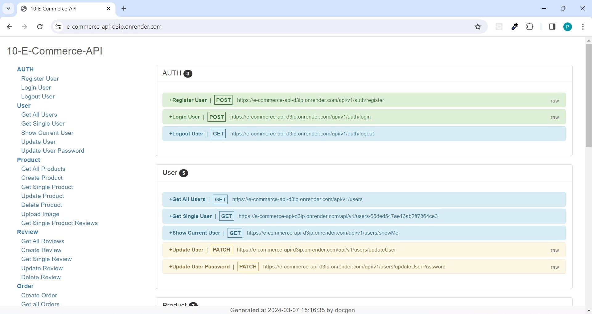

# E-Commerce API

#### Overview

REST APIs or Backend for an e-commerce application. MVC architecture implementation with CRUD Functionality. MongoDB database used for storing data and mongoose used for data operations. Role based authentication and authorization using JWTs and http cookies. Restricted resource access based on the roles and authorization. Tested the apis using POSTMAN. Document generated using docgen. Hosted on render.

#### Links

[Live APP](https://e-commerce-api-d3ip.onrender.com/)

#### Features

- REST APIs / Backend for an E-commerce App
- Role based authentication and resource access privilege
- MVC architecture and CRUD Functionality implementation
- JSON Web Tokens via http cookies

#### Tech Stack

- NodeJS
- ExpressJS
- JWT
- POSTMAN
- Docgen
- MongoDB
- Mongoose

### Images

#### API Documentation

